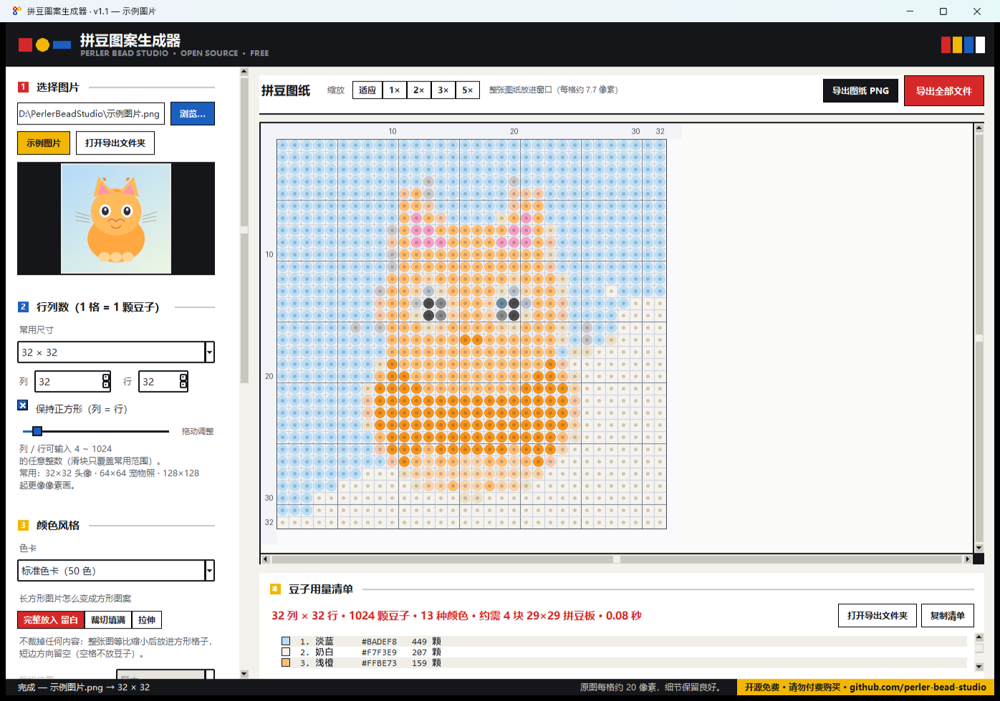
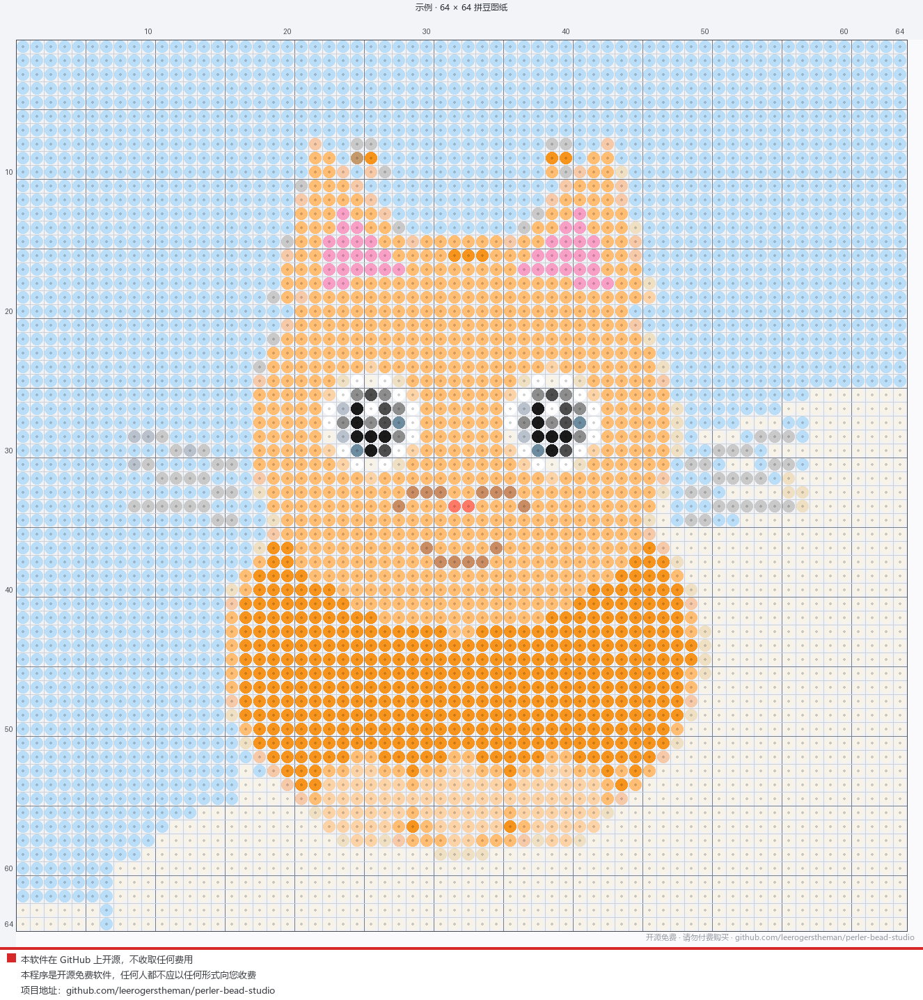

# 拼豆图案生成器 · Perler Bead Studio

把任意一张图片变成**拼豆（拼拼豆豆 / Perler Beads）图纸**：自由选择行×列（16×16、29×29、32×32，一直到 1024×1024），
自动把每个格子匹配成最接近的拼豆颜色，并统计**每种颜色需要多少颗豆子**。

界面为**包豪斯（Bauhaus）风格**：三原色 + 黑白、直角直线、方形色块按钮、粗细对比排版。



## 下载即用（推荐给普通用户）

**最省事：直接下单个 exe，双击就能用，不用解压、不用装 Python。**

| 下载 | 大小 | 说明 |
| --- | --- | --- |
| [**PerlerBeadStudio.exe**](https://github.com/leerogerstheman/perler-bead-studio/releases/latest/download/PerlerBeadStudio.exe) | **30 MB** | **推荐**。单文件程序，双击直接运行，不需要安装任何东西。首次启动会解压到临时目录，大约等 3~8 秒。（也在本仓库根目录里） |
| [**perler-bead-studio-full.zip**](https://github.com/leerogerstheman/perler-bead-studio/releases/latest/download/perler-bead-studio-full.zip) | 49 MB | 自带 Python 运行环境的**文件夹版**，解压后双击 `启动.bat`。启动比 exe 快，适合经常用、想放 U 盘的人。 |
| [perler-bead-studio-lite.zip](https://github.com/leerogerstheman/perler-bead-studio/releases/latest/download/perler-bead-studio-lite.zip) | 0.6 MB | 电脑上已装好 Python 3.10+ 与 Pillow 的人，只有源码。 |

想直接用 exe 打开某张图片：把图片**拖到 exe 图标上**，或在命令行里
`PerlerBeadStudio.exe D:\图片.png`。

> exe 与文件夹版功能完全一样。区别只在启动方式：
> exe 是单文件、启动时解压（每次约 3~8 秒）；文件夹版启动快、但文件多。
>
> 更多版本见 [Releases](https://github.com/leerogerstheman/perler-bead-studio/releases)。

> ### ⚠️ 本软件开源免费
> 本软件在 GitHub 上开源（[本仓库](https://github.com/leerogerstheman/perler-bead-studio)），**不收取任何费用**。
> 若您付费以获取此工具，请立即退款。
> 程序首次启动时会弹出这条声明，勾选「不再显示」后就不再打扰。

## 特性一览

| | |
| --- | --- |
| **尺寸任选** | 4×4 ~ **1024×1024**（最大 105 万颗豆子），支持长方形图案；1024×1024 转换约 0.9 秒 |
| **颜色匹配** | 内置标准 50 色 / 精简 32 色 / 极简 16 色三套拼豆色卡，按感知加权距离取最近色 |
| **颜色抖动** | 标准 Floyd–Steinberg 误差扩散（顺序扫描，无横向条纹），渐变过渡自然 |
| **背景处理** | 透明区域自动留空；纯色背景可从四边泛洪填充一键去掉，容差可调 |
| **智能裁剪** | 自动去掉四周留白；长方形图片可选「完整放入 / 裁切填满 / 拉伸」，裁切位置可选居中或靠上留头部 |
| **格式支持** | JPG / PNG / WEBP / BMP / GIF / TIFF / ICO 等 40+ 种，手机竖拍照片按 EXIF 自动转正 |
| **导出齐全** | 圆豆图纸 PNG、矢量 SVG、成品效果图、挑豆清单 TXT、颗数 CSV、格子编号 CSV、可打印网页 HTML |
| **实时预览** | 鼠标悬停查看每格坐标与色号；适应窗口 / 1× ~ 5× 缩放；百万格图案仍是秒级响应 |
| **免安装** | 自带 Python 运行时的完整包可直接拷走；仓库版只需 Python 3.10+ 与 Pillow |



## 快速开始

### 方式一：直接用源码跑（推荐）

```bat
git clone https://github.com/leerogerstheman/perler-bead-studio.git
cd perler-bead-studio
pip install pillow
python studio.py
```

也可以直接双击 **`启动.bat`**，它会自动寻找电脑上的 Python 环境并检查依赖。

### 方式二：做成免安装的完整包

仓库里不含 Python 运行时（162 MB，不入版本库）。想做成「拷到任何 Windows 电脑都能跑」的完整包：

```powershell
# 需要本机已有一个装好 Pillow 的 Python
powershell -ExecutionPolicy Bypass -File deploy_runtime.ps1
# 也可以指定别的 Python 目录
powershell -ExecutionPolicy Bypass -File deploy_runtime.ps1 -Source "C:\Python312"
```

### 方式三：打包成单个 exe

```bat
构建EXE.bat          :: 需要先 pip install pyinstaller，图标会自动带上
```

### 使用流程

1. 点左侧「**浏览…**」选一张图片，或点「**示例图片**」先试玩。
2. 用「**常用尺寸**」下拉框或「**列 / 行**」输入框选择格子数（4 ~ 1024）。
3. 右侧实时显示拼豆图纸；鼠标移到图纸上可看到每格的坐标与色号。
4. 点「**导出全部文件**」，在 `导出\<图片名>_<列>x<行>\` 里得到全套图纸。

> 如果双击 `启动.bat` 没反应，说明电脑上没有可用的 Python —— 装一个 Python 3.10+ 并
> `pip install pillow` 即可；`启动.bat` 会打印中文安装指引。

## 长方形图片怎么处理（重要）

**不限于正方形图片，任何长宽比的图都能用**：横图、竖图、全景图、超宽图都可以，程序内部一律按
「先等比缩放，再放进格子」处理，分三步：

1. **读图**：读取图片并按 EXIF 转正（手机竖拍照片不会躺倒）；
2. **（可选）裁剪留白**：勾选「自动裁剪留白」时，把四周的空白边去掉，只留主体；
3. **放进格子**：按下面选好的方式缩放到你设定的列×行。

第 3 步有三种做法，在界面「长方形图片怎么变成方形图案」里选：

| 选项 | 处理逻辑 | 结果 | 什么时候用 |
| --- | --- | --- | --- |
| **完整放入（留白）** | 等比缩小到整张图都能放进格子（`缩放比 = min(列/宽, 行/高)`），短边方向居中留空 | 不裁掉任何内容；空白格不放豆子（导出图纸上显示为浅灰空格） | 想保留整张图，或背景本身是画面的一部分 |
| **裁切填满** | 等比放大到铺满整块格子（`缩放比 = max(列/宽, 行/高)`），长边多出来的部分裁掉 | 没有空格，豆子占满整块；可再选「裁切位置」决定保留哪一块 | 想让主体尽量大、不要留白（做挂件最常用） |
| **拉伸（会变形）** | 直接按 `列×行` 重采样，不做等比 | 没有空格，但人物会变胖/变瘦 | 一般不建议，除非原图比例本来就很接近 |

举例：一张 **16:9 的横图** 转成 **32×32** 的图案：

- 完整放入 → 图案实际占 **32 列 × 18 行**，上下各留 7 行空格，豆子 **576 颗**
- 裁切填满 → 铺满 **32×32**，左右各省掉一部分，豆子 **1024 颗**

「裁切位置」有 **居中 / 靠上（留头部） / 靠下 / 靠左 / 靠右** 五种，只在「裁切填满」时可用，
选别的模式会自动变灰。竖图转方图时选「靠上」最容易留住人脸。

### 想要长方形图案（不是正方形）？

把「行列数」里的**列和行设成不一样**就行，例如列 `64`、行 `32`（记得取消勾选「保持正方形」），
这样输出的是 64×32 的长方形图案，豆子也是按长方形排布。此时上面三种方式照常生效：
图片会先按这个长方形的比例去放，而不是硬塞进正方形。

导出的 PNG / SVG / HTML 都会按实际列×行出图，长方形图案的坐标标注也一样清楚。

## 支持的图片格式

**JPG 和 PNG 都完全没问题**，另外还支持下面这些（打开文件时的下拉框已经分好类）：

| 格式 | 扩展名 | 说明 |
| --- | --- | --- |
| JPEG | `.jpg .jpeg .jpe .jfif` | 照片、网图最常用；灰度图和 CMYK 图也能读 |
| PNG | `.png .apng` | 支持**透明背景**，透明处默认不放豆子 |
| WEBP | `.webp` | 网页图，支持透明 |
| BMP | `.bmp .dib` | Windows 画图导出的图 |
| GIF | `.gif` | 表情包（取第一帧） |
| TIFF | `.tif .tiff` | 扫描件、印刷用图 |
| ICO / CUR | `.ico .cur` | 图标文件 |
| 其它 | `.tga .pcx .ppm .pgm .pbm .pnm .dds .psd .xbm .xpm` | 也能读，选「所有文件」即可 |

还有一个细节：**手机竖着拍的照片会自动转正**（读取 EXIF 方向信息），不会出现躺倒的图案。

关于图片质量，注意这几点：

- **尺寸**：程序会把超过 1600 像素的长边先等比缩小再处理，所以超大的原图也能秒开，不必自己裁剪。
- **清晰度**：一张图最终要压进 16×16 或 64×64 个格子，原图越大越清晰，程序会提示「原图每格约多少像素」。
- **主体要大**：建议勾选「自动裁剪留白」，让主体尽量占满画面。
- **背景干净**：纯色背景的图可以勾选「去掉纯色背景」，这样背景处不放豆子，成品更好看。
- **透明图**：PNG / WEBP 的透明区域默认就是空格（不放豆子）；如果不想保留透明，取消「去掉纯色背景」即可把它填成白底。
- **动画图**：GIF / 动态 WEBP 只取第一帧。

## 功能

| 功能 | 说明 |
| --- | --- |
| 行列数任选 | **4 × 4 到 1024 × 1024**（最大 1,048,576 格 ≈ 105 万颗豆子）；预设 16×16 / 24×24 / 29×29 / 32×32 / 48×48 / 58×58 / 64×64 / 80×80 / 96×96 / 128×128 / 192×192 / 256×256 / 384×384 / 512×512 / 768×768 / 1024×1024，另有 64×32、128×64 长方形预设 |
| 保持正方形 | 勾选后列=行；也可分别设置宽高做长方形图案 |
| 三种色卡 | 标准 50 色 / 精简 32 色 / 极简 16 色（`palettes/` 里放 JSON 可加自己的色卡） |
| 颜色抖动 | 标准 Floyd–Steinberg 误差扩散（严格按扫描顺序，没有横向条纹），照片建议开 |
| 去纯色背景 | 从四边泛洪填充，把纯色背景变成「不放豆子」的空格（可调容差） |
| 自动裁剪留白 | 只保留画面主体，主体在图案里更大更清楚 |
| 填充方式 | 完整放入（留白）/ 裁切填满 / 拉伸；裁切时可指定保留哪一块 |
| 坐标与网格 | 行列号标在 5 的倍数处，和拼豆板的 5×5 分区一致 |
| 豆子清单 | 实时统计颜色编号、色值、颗数，可一键复制 |
| 多种导出 | 图纸 PNG、矢量 SVG、成品效果图 PNG、清单 TXT/CSV、格子编号 CSV、可打印网页 HTML |

## 尺寸与速度

行列数上限是 **1024 × 1024**（1,048,576 格）。实测数据（自带运行时，普通笔记本）：

| 尺寸 | 格数 | 转换耗时 | 开抖动耗时 | 导出图纸边长 | 适合 |
| --- | --- | --- | --- | --- | --- |
| 64 × 64 | 4,096 | 0.01s | 0.02s | 2100 px | 挂件、头像 |
| 128 × 128 | 16,384 | 0.03s | 0.05s | 2684 px | 细节丰富的头像 |
| 256 × 256 | 65,536 | 0.07s | 0.10s | 5284 px | 大幅面作品 |
| 512 × 512 | 262,144 | 0.23s | 0.36s | 5292 px | 接近像素画 |
| **1024 × 1024** | **1,048,576** | **0.94s** | **1.51s** | **5164 px** | 最大档，约 105 万颗豆子 |

几点说明：

- **预览会自动降级**：超过 26,000 格时，界面预览和导出改用「纯色格子」画法（快很多，百万格也是秒级）；
  小尺寸仍然画成圆豆子图纸。
- **超大图案会自动跳过 SVG 和 HTML 导出**：4 万格以上不导 SVG，40 万格以上不导 HTML，
  否则文件会有几十上百 MB、浏览器打不开。需要矢量图就把尺寸降到 200×200 以内。
- **导出图纸的格边长自动选择**：64×64 以内 32 px/格，256 以内 20 px/格，512 以内 10 px/格，
  更大时 5 px/格，保证导出 PNG 边长在 5000 像素左右——既看得清，又能打开。
- **1024×1024 的豆子量非常夸张**：约需 1296 块 29×29 拼豆板（界面会提示预计板数）。
  动手前建议先看「豆子清单」估一下成本。

### 导出的文件

| 文件 | 用途 |
| --- | --- |
| `*_图纸.png` | 圆豆子图纸，带行列坐标和 5 格粗网格线，照着摆豆子用 |
| `*_矢量图纸.svg` | 矢量版图纸，放大打印不模糊（超大图会自动跳过） |
| `*_效果图.png` | 去掉网格的成品效果，先看成品长什么样 |
| `*_豆子清单.txt` | 挑豆子用的勾选清单，可直接打印 |
| `*_豆子清单.csv` | 每色颗数（Excel 可打开，用于买豆子） |
| `*_格子编号.csv` | 每格的颜色编号表，方便逐行核对 |
| `*_网页图纸.html` | 浏览器打开，带图例和颜色表，可直接打印 |

## 操作说明

- **缩放**：右上角「适应 / 1× / 2× / 3× / 5×」，旁边会实时显示当前每格多少像素。
  - **适应** = 整张图纸刚好放进窗口，用来看整体效果；
  - **1× / 2× / 3× / 5×** = 每格固定 12 / 24 / 36 / 60 像素，放大会超出窗口，拖动滚动条看局部。
  - 小图（16×16）的「适应」可能比 1× 还大，这是正常的：适应是"看全图"，1× 是"按固定像素看"。
  - 超大图案（512×512 以上）受渲染预算限制，放不下的档位会**自动置灰**，不会出现"点了没反应"。
- **图纸模式**：「圆豆子图纸」是摆豆子用的；「成品像素效果」是去掉网格的纯色格子预览。
- **快捷键**：`Ctrl+O` 选择图片，`Ctrl+S` 导出全部，`F5` 重新生成，`Esc` 取消输入焦点。
- 图片很大时预览会自动切换成纯色格子以保证流畅，**导出的 PNG 仍是完整圆豆图纸**。

## 运行环境

只需要 **Python 3.10 或更高**，外加 **Pillow**：

```bat
pip install pillow
```

`启动.bat` 会按下面的顺序自动寻找可用解释器（并检查 tkinter 与 Pillow 是否齐全）：

1. 本文件夹自带的 `python\python.exe`（如果你用 `deploy_runtime.ps1` 生成了免安装运行时）；
2. 系统 PATH 里的 `python` / `py -3`（会自动跳过微软商店的占位程序）；
3. `%LOCALAPPDATA%\Programs\Python\Python3xx`、`C:\Python3xx` 等常见安装位置。

找不到可用环境时，`启动.bat` 会打印中文安装指引，而不是闪退。

> 仓库里**不包含** `python\` 运行时目录（162 MB，不适合进版本库，`.gitignore` 已排除）。
> 需要「拷到任何电脑都能跑」的完整包时，用下面的命令在本地生成：

```powershell
powershell -ExecutionPolicy Bypass -File deploy_runtime.ps1
# 也可以指定别的 Python 目录：
powershell -ExecutionPolicy Bypass -File deploy_runtime.ps1 -Source "C:\Python312"
```

## 目录结构

```
perler-bead-studio\
├─ 启动.bat              ← 双击这里运行（Windows）
├─ studio.py             图形界面（Tkinter + 包豪斯风格）
├─ bauhaus.py            包豪斯风格组件（色板、方形按钮/勾选框/滑块、分段选择器）
├─ core.py               核心算法：去背景、缩放、颜色匹配、抖动、统计
├─ painter.py            图纸渲染与导出（导出文件都带免费声明水印）
├─ palette.py            内置色卡与自定义色卡读取
├─ notice.py             启动声明窗口（开源免费提醒 + 不再显示）
├─ notice_core.py        声明内容（混淆存放 + HMAC 签名，防篡改）
├─ settings.py           用户设置读写（本机 settings.json，不入版本库）
├─ launcher.py           启动器：找 Python、检查依赖、打开界面
├─ app.ico / app_icon.png  程序图标（拼豆 + 包豪斯）
├─ make_icon.py          生成程序图标
├─ make_notice.py        改声明文案后重新打包并签名
├─ make_sample.py        生成示例图片
├─ deploy_runtime.ps1    生成本地免安装 Python 运行时（可选）
├─ 构建EXE.bat           打包成单个 exe（可选，需要 PyInstaller）
├─ palettes\             自定义色卡目录（放 JSON 就能加自己的色卡）
├─ 示例图片.png 等        示例素材
├─ selftest.py           自检：转换 + 导出全流程，无需界面
├─ guitest.py            界面冒烟测试（含缩放、1024×1024）
├─ noticetest.py         启动声明测试（勾选后是否真的不再弹）
├─ tampertest.py         对抗测试（删/改声明的 7 种做法都失败）
├─ screenshot.py         界面截图工具
├─ LICENSE               MIT
└─ README.md             本文件
```

## 自定义色卡

在 `palettes\` 里新建一个 `.json`，例如 `我的色卡.json`：

```json
{
  "名称": "我的拼豆色卡",
  "colors": [
    ["白色", "#FFFFFF"],
    ["大红", "#D62828"],
    ["宝蓝", "#1B5FC1"]
  ]
}
```

保存后在界面「色卡」下拉框里就能选到它（重启程序生效）。

## 怎么选行列数

- **16×16 / 24×24**：钥匙扣、挂件，图案要大要简单，细节几乎没有。
- **29×29 / 32×32**：一块标准小方板能做出来，卡通头像、图标最合适。
- **48×48 / 58×58**：一块大方板，人物、宠物照片能看出表情。
- **64×64 ～ 128×128**：细节丰富，适合照片；豆子用量开始变大。
- **256×256 ～ 1024×1024**：属于「大工程 / 像素画」级别，几百到上百万颗豆子，
  更适合当电子图纸或分块制作；程序会自动用纯色格子方式渲染，速度依然是秒级。
- 程序会提示「原图每格约多少像素」，每格不足 6 像素时细节会明显丢失，可以考虑加大行列数。
  反过来说，如果你设了 1024×1024 但原图只有 640×640，那 1 格还摊不到 1 个像素，
  图案会偏「糊」——这种时候可以先用小一点的尺寸，或者换更大的原图。

## 自检与打包

```bat
:: 全流程自检（不需要显示器，会打印每项检查结果）
python selftest.py

:: 界面冒烟测试（会真的建窗口，测完自动关闭）
python guitest.py

:: 启动声明测试（勾选后是否真的不再弹出）
python noticetest.py

:: 对抗测试（尝试删/改声明的 7 种做法，验证都失败）
python tampertest.py

:: 改声明文案（自动重新混淆 + 签名）
python make_notice.py

:: 界面截图（存到 _预览\ 目录，含启动声明窗口）
python screenshot.py

:: 打包成单个 exe（需要先 pip install pyinstaller）
构建EXE.bat
```

> 上面这些命令里的 `python` 可以换成自带的解释器：`python\python.exe selftest.py`。

## 常见问题

**Q：图案看着很糊 / 颜色不对？**
尽量用清晰、主体大、背景干净的图；勾选「去掉纯色背景」和「自动裁剪留白」；照片类图片建议开「颜色抖动」。

**Q：想要更多渐变层次？**
换「标准色卡（50 色）」，并打开「颜色抖动」。反之，想让图案更「像素风」就选极简 16 色并关掉抖动。

**Q：背景被误删了，或者背景没删干净？**
调整「容差」滑块：误删就调小，没删干净就调大；也可以取消「去掉纯色背景」。

**Q：豆子数量怎么看？**
右侧「豆子用量清单」实时显示每色颗数；导出后 `*_豆子清单.csv` 可按颜色去买豆子。

---

颜色值为屏幕显示近似值，不同品牌（Hama / Perler / Artkal）同色号会有轻微差异，成品以实物为准。
